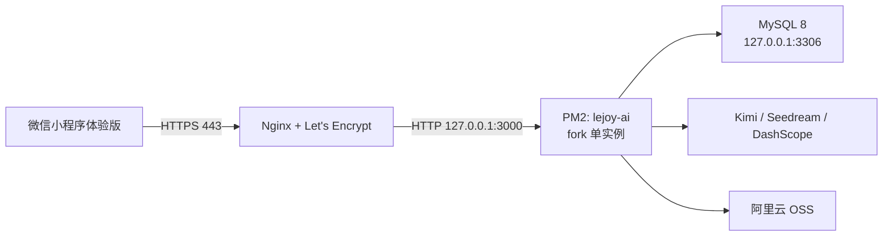

# 乐享AI D1 部署记录

## 部署目标

- 环境：阿里云 ECS，Ubuntu 22.04，上海
- API 域名：`https://api.hxzhineng.xyz`
- 代码分支：`codex/m4-release-ready`
- 部署状态：待执行
- 部署时间：待执行
- 部署提交：待执行

## 架构



Nginx 是唯一公网应用入口；Node 进程与 MySQL 均只通过本机地址通信。PM2 固定为 `fork_mode` 单进程，保证生成请求幂等缓存只存在一份。

## 自动化脚本

| 脚本                             | 职责                                                     | 幂等策略                                                                                          |
| -------------------------------- | -------------------------------------------------------- | ------------------------------------------------------------------------------------------------- |
| `scripts/deploy/01-init.sh`      | 系统升级、Node/pnpm/PM2/Nginx/MySQL、数据库账号、2G swap | 已安装软件重复安装无副作用；数据库与账号使用 `IF NOT EXISTS`；密码存在时复用；swap/fstab 重复检查 |
| `scripts/deploy/02-deploy.sh`    | 克隆/快进更新、生产环境改写、构建迁移、PM2 发布          | 仅允许干净生产工作树与 `--ff-only`；环境键原位更新；迁移可重复；PM2 `startOrReload`               |
| `scripts/deploy/03-nginx-ssl.sh` | Nginx 反代、acme.sh 证书、HTTPS/续期验收                 | 配置文件覆盖为确定内容；证书重复签发由 acme.sh 判断；安装证书保留 reload hook                     |

首次部署命令（均从本机发起）：

```bash
scp scripts/deploy/01-init.sh root@47.100.254.32:/root/01-init.sh
ssh root@47.100.254.32 'bash /root/01-init.sh'

scp scripts/deploy/02-deploy.sh root@47.100.254.32:/root/02-deploy.sh
ssh root@47.100.254.32 'bash /root/02-deploy.sh --prepare'
scp .env root@47.100.254.32:/opt/lejoy-ai/.env
ssh root@47.100.254.32 'chmod 600 /opt/lejoy-ai/.env && bash /opt/lejoy-ai/scripts/deploy/02-deploy.sh'

ssh root@47.100.254.32 'EXPECTED_IP=47.100.254.32 bash /opt/lejoy-ai/scripts/deploy/03-nginx-ssl.sh'
```

后续更新：

```bash
ssh root@47.100.254.32 'bash /opt/lejoy-ai/scripts/deploy/02-deploy.sh'
```

## 服务器路径

| 内容                 | 路径                                         |
| -------------------- | -------------------------------------------- |
| 应用仓库             | `/opt/lejoy-ai`                              |
| 生产环境变量         | `/opt/lejoy-ai/.env`（权限 `600`）           |
| 部署生成的数据库密码 | `/root/DEPLOY_SECRETS.txt`（权限 `600`）     |
| Nginx 站点           | `/etc/nginx/sites-available/lejoy-ai`        |
| HTTPS 证书           | `/etc/nginx/ssl/api.hxzhineng.xyz/`          |
| acme.sh              | `/root/.acme.sh/`                            |
| 部署执行日志         | `/var/log/lejoy-ai-deploy.log`（权限 `600`） |
| PM2 状态快照         | `/root/.pm2/dump.pm2`                        |

`DEPLOY_SECRETS.txt` 不进入仓库、不通过聊天传输。部署完成后，用户应登录服务器将其中密码转存到密码管理器；日常排障不要执行会输出 `.env` 或该文件内容的命令。

## 常用运维命令

```bash
ssh root@47.100.254.32 'pm2 status'
ssh root@47.100.254.32 'pm2 logs lejoy-ai --lines 100 --nostream'
ssh root@47.100.254.32 'systemctl status nginx mysql pm2-root --no-pager'
ssh root@47.100.254.32 'nginx -t'
ssh root@47.100.254.32 '/root/.acme.sh/acme.sh --list'
curl https://api.hxzhineng.xyz/api/mp/health
```

## 管理员积分 CLI

CLI 从服务器 `/opt/lejoy-ai/.env` 读取数据库连接，不输出连接串或密钥。

```bash
ssh root@47.100.254.32 'cd /opt/lejoy-ai && pnpm tsx scripts/admin-credits.ts list'
ssh root@47.100.254.32 'cd /opt/lejoy-ai && pnpm tsx scripts/admin-credits.ts recharge 12 100 体验期赠送'
ssh root@47.100.254.32 'cd /opt/lejoy-ai && pnpm tsx scripts/admin-credits.ts set-admin 12'
```

`list` 只显示 OpenID 前六位并追加掩码；`recharge` 调用现有 `rechargeCredits`，同时记录积分流水。

## 验收记录

| 验收项                              | 结果     | 证据摘要               |
| ----------------------------------- | -------- | ---------------------- |
| HTTPS health 200                    | 待执行   | 待执行                 |
| 未鉴权 modules 401                  | 待执行   | 待执行                 |
| HTTPS 证书有效与自动续期            | 待执行   | 待执行                 |
| PM2 开机自启、fork 单实例           | 待执行   | 待执行                 |
| MySQL 表结构完整                    | 待执行   | 待执行                 |
| 管理员 CLI list/充值契约            | 待执行   | 待执行                 |
| 小程序产物指向生产 API              | 待执行   | 待执行                 |
| 真机登录、初始 100 积分、修图全流程 | 用户确认 | 需体验版上传和真机操作 |

## 微信后台待办清单

- [ ] 微信开发者工具打开仓库 `miniprogram` 目录，点击“上传”；版本号填 `0.9.0`，备注填“体验版试用”。
- [ ] 登录 `mp.weixin.qq.com`，进入“版本管理”，将该开发版本设为体验版并生成体验二维码。
- [ ] 在“成员管理”添加试用同事的微信号为体验成员。
- [ ] 在“开发 → 开发设置 → 服务器域名”中，将 request 合法域名添加为 `https://api.hxzhineng.xyz`。
- [ ] 将 downloadFile 合法域名添加为 `https://api.hxzhineng.xyz` 和 `https://lejoy-ai-prod.oss-cn-shanghai.aliyuncs.com`。
- [ ] 手机扫描体验码，验证真实微信登录后获得 100 初始积分，并完整测试一次选图/上传/修复/结果保存流程。

体验期保持 `CONTENT_SECURITY=off`。微信消息推送配置完成前，不切换为 `wechat`。
